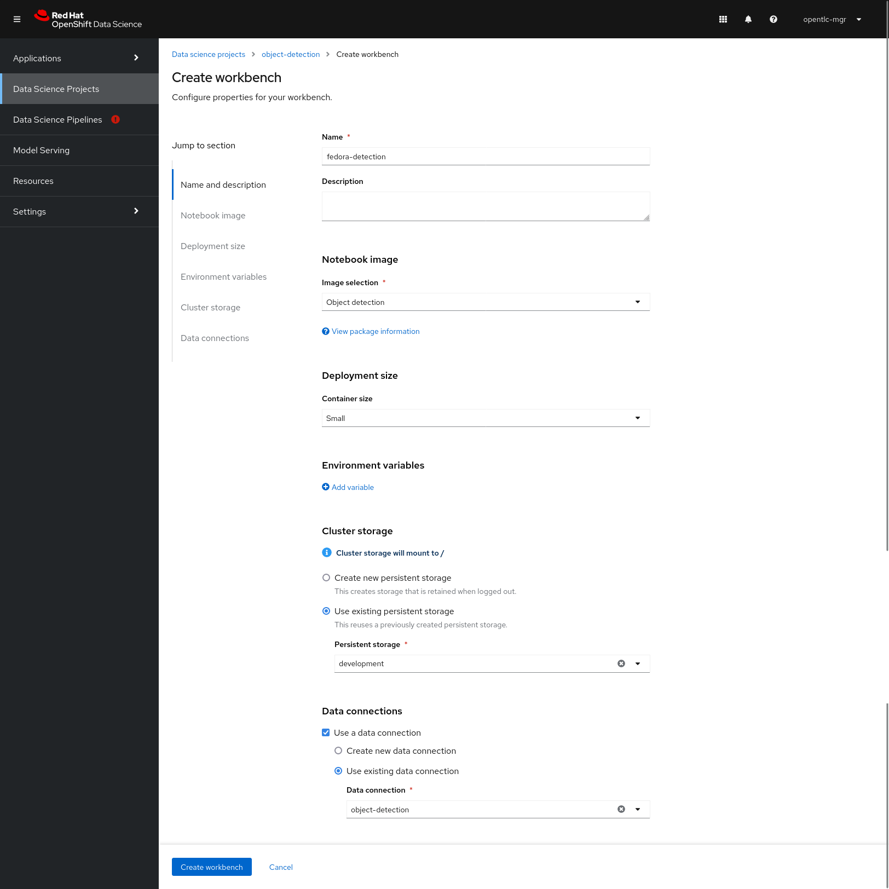
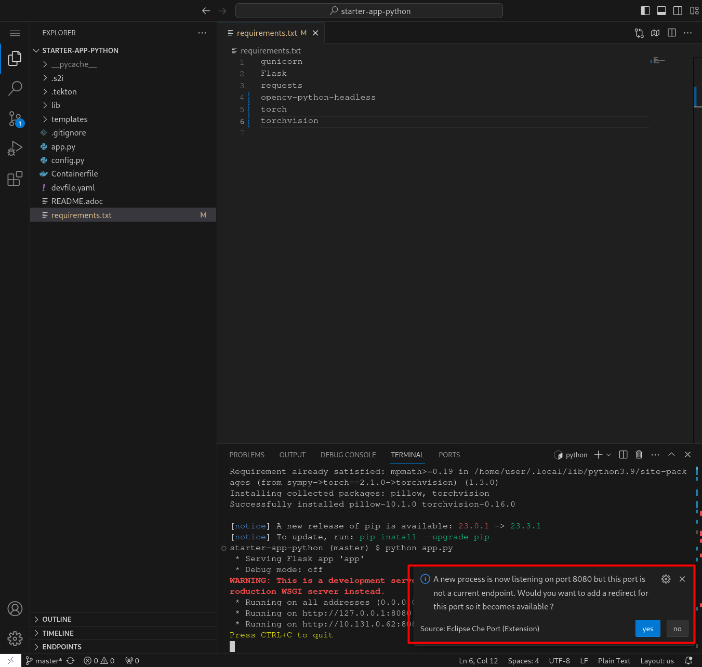
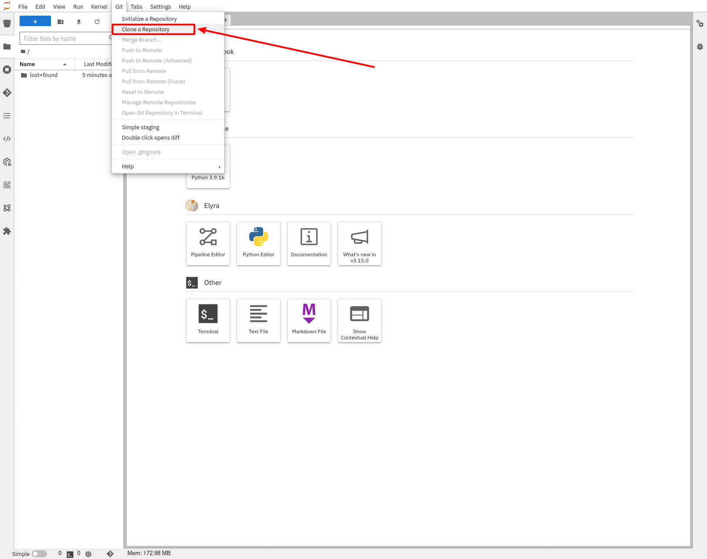
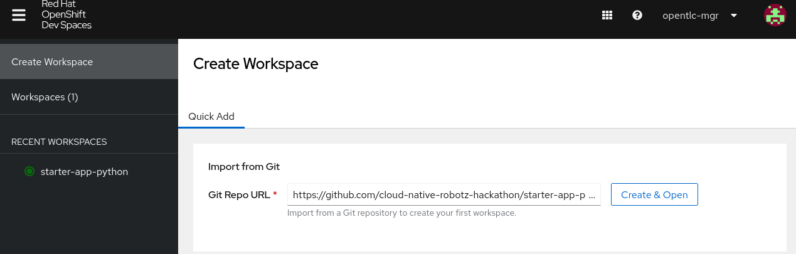
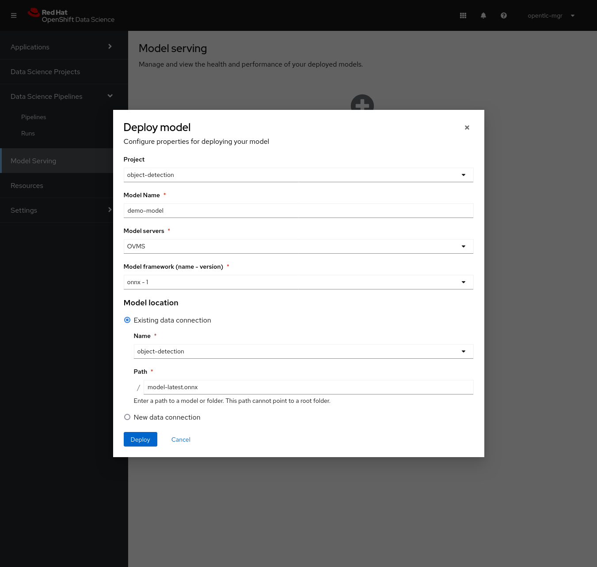

# AI Robots

**For improvements please create Issues at**:  \
[https://github.com/cloud-native-robotz-hackathon/devel-bucket/issues](https://github.com/cloud-native-robotz-hackathon/devel-bucket/issues)

# Start
## Git Repository clone

* Open Gitea: [http://repository-git.apps…](http://repository-git.apps…).
* Login: gitea / gitea
* New Migration -> Type “git” -> URL: [https://github.com/cloud-native-robotz-hackathon/starter-app-python.git](https://github.com/cloud-native-robotz-hackathon/starter-app-python.git)

## Instantiate Workbench

The demo content includes a number of usecases, we'll use the object detection scenario.

* Open the minio Route in the minio project
    * URL: [https://minio-ui-minio.apps](https://minio-ui-minio.apps)…../buckets/add-bucket
    * Login with
        * Name : minio
        * Pass : minio123
    * In the menu left click “Buckets”
        * “Create Bucket”
        * Bucket Name : object-detection
        * Create Bucket
* In your OpenShift cluster, find the route to the RHODS dashboard (_rhods-dashboard_) and open the dashboard (login with cluster credentials)
* Enter the object-detection project.
* Create a new workbench and these parameters:
    * Name : fedora-detection
    * Image selection: Object detection
    * Existing cluster storage: development
    * Existing data connection: using existing 		object-detection
    * Click Create Workbench \



* Wait for the workbench to be started, click _Starting..._ near _Status_ and watch the _Event Log_
* Open the workbench through the link,
    * in the left menu go to _Git_, click _Clone a Repository_ and clone the repo [https://github.com/mamurak/os-mlops.git](https://github.com/mamurak/os-mlops.git)



* Navigate to _notebooks/object-detection_ and follow the instructions in os-mlops/_notebooks/object-detection-example/demo-setup.ipynb_.

## Model training

Now create and run the model training as a pipeline with Elyra and Data Science Pipelines. The training pipeline uses images from the _Open Images Dataset V7_. ([https://storage.googleapis.com/openimages/web/index.html](https://storage.googleapis.com/openimages/web/index.html))

We'll use three classes in our training: _Ball_, _Tennis ball_ and _Fedora_. Access the image database website, click Explore, search for the classes and have a look at the images. To configure the pipeline, open the file _configuration.yaml_ in the Jupyter Notebook and replace the class names with the classes listed above. Hit _Ctrl-s_ to save.

* In the Jupyter Notebook navigate to the os-mlops/notebooks/object-detection_example/model-training folder
* Open the appropriate Elyra pipeline, i.e. model-training-gpu.pipeline if you have enabled GPUs in your cluster, else model-training-cpu.pipeline.
* Open configuration.yaml
    * Set `: names: ['Fedora', 'Ball', 'Tennis ball']`
    * Save the file
* In the Pipeline Editor click Run Pipeline to submit the pipeline to the Data Science Pipelines backend.
* Track the pipeline progress in the RHODS dashboard: Data Science Pipelines->Runs->Triggered
* Once the pipeline run has completed, check for the trained model in the _object-detection_ bucket in Minio using the Object Browser.


## Model Serving

You now have a trained model for object recognition. To use the model we deploy it into RHODS Model Serving:

* Access the RHODS dashboard, in Data Science Projects choose _object-detection_
* Under Models and model servers click Deploy model for the appropriate model server, i.e. Triton if you enabled GPUs in your cluster, else OVMS.
* In the form enter
    * Project: object-detection
    * Model Name: demo-model
    * Model framework: ONNX
    * Choose _Existing data connection_: object-detection
    * _model-latest.onnx_ as Folder path.



* Select Deploy
* Wait for the server to start
* Copy the Inference endpoint URL
* Open the _online-scoring_ notebook.
* Paste the inference endpoint URL into the placeholder of the _prediction_url_ variable.
* Make sure the class labels are
    *  ['Fedora', 'Ball', 'Tennis ball']
* Run the full notebook (The with the two Play Icons)
* You will see the identified cluster

**Model Testing**

* Open the Notebook object-detection-example/model-training/os-mlops/notebooks/object-detection-example/online-scoring.ipynb
* Run the entire Notebook (Double Play Icon)
* Upload an Image of your own sample-images
* Reference it in image_path = './sample-images/&lt;Your Image>
* And run the testing again


## Setup Skupper / Red Hat Service Interconnect

Details: [https://github.com/cloud-native-robotz-hackathon/devel-bucket/tree/master/skupper](https://github.com/cloud-native-robotz-hackathon/devel-bucket/tree/master/skupper)

Will be presented

## **App Development**

* Open the DevSpaces URL
    * Create Workspace
    * Git Repo URL :
        * Open your Gitea Repo and navigate to the devfile.yaml, then click on Originalversion / Raw
        * Copy the URL
    * Create and Open and paste the URL



* Clone your Gitea Repo
    * Clone to /projects
* Install requirements with pip
* Open a Terminal by clicking in “Hamburger Icon”
    * Install the required python packages
        * `pip install -r requirements.txt`
        * `export PYTHONDONTWRITEBYTECODE=1`
        * `export PATH=$PATH:/home/user/.local/bin`
    * Start the app
        * `gunicorn -b 0.0.0.0:8080 app --reload`
* Click on hint in the bottom right corner to expose the route
    * Click on Open



* A Tab with the web interface of the app will open
    * Make sure you are on `http://` if the page does not open
* Curl Example:

```bash
curl -X POST -v http://hub-controller-live.at-the-edge.svc.cluster.local:8080/api/robot/backward/10?user_key=terminator
```

To get an Image:
```bash
curl -X GET -v http://hub-controller-live.at-the-edge.svc.cluster.local:8080/api/robot/camera?user_key=terminator | base64 -d > image.jpg</code>
```

Edit the config.yaml to

* Add your inferencing endpoint
    * Your robot endpoint and token will be given to you
```
ROBOT_API = 'http://hub-controller-live.at-the-edge.svc.cluster.local:8080/api/robot'
API_TOKEN = '' # terminator or abcwarrior
INFERENCING_API = '' # Your cluster specific model serving url
```

* In DevSpaces open app.py and look at the commented out code samples
    * Start to code
    * Call the run function by clicking on the start button on the app website

# Appendix
## Robot API

* POST /forward/\<length\>
    * Forward length
* POST /backward/\<length\>
    * Backwards length
* POST /left/\<degrees\>
    * Turn leftdegrees
* POST /right/\<degrees\>
    * Turn right degrees
* GET /distance
    * Distance in mm

## Setup
### Requirements

* _RHODS on OCP on AWS with NVIDIA GPUs_ RHDP Cluster
* OpenShift Data Science operator
* OpenShift Pipelines operator
* oc logged in to cluster
* Create OCP / RHODS Project per user and give edit rights to user
* Delete LimitRange for RHODS
* Install OCP Pipelines
* Create customized DevSpaces Image with required Dependencies
* HubController Deployed to SNO
* HubController DeploymentConfig -> Deployment
* Hubcontroller ConfigMap set Robot Hostnames

### Setup

* Install Codeflare operator (for simple object storage)
* Clone [https://github.com/mamurak/os-mlops.git](https://github.com/mamurak/os-mlops.git)
* Navigate to _manifests_ folder
* Run _oc apply -f projects.yaml_
* Run _oc apply -k ._ (this uses the kustomization.yaml file)

Once the manifests have been deployed, your environment contains some content needed for demos (check for yourself):

* A Minio instance as a lightweight S3 storage provider. You can manage the S3 buckets through the Minio UI through the minio-ui route URL in project minio. Use minio and minio123 for logging in.
* A Data Science Project fraud-detection for running the fraud detection demo. The pipeline server is instantiated and cluster storage and data connections are configured.
* A Data Science Project object-detection for running the object detection demo. The pipeline server is instantiated and cluster storage and data connections are configured. The OVMS model server is instantiatend for model deployment.
* A Data Science Project huggingface-demo for running the Huggingface demo. Cluster storage is configured.
* A number of community workbench images.
* A number of custom serving runtimes.

## A-Team Tasks

1. GitOps Multi Tenant konfigurieren & testen
2. OpenVino on ARM
3. ML Model Performance & Tuning
4. Skupper / Service Interconnect
5. REST-HTTP Calls auf GRPC ändern (Camera, Inferencing)
6. Quarkus App mit Inferencing verbinden und testen
7. Ansible Automate Setup of ODS and Projects
8. HubController modernisieren
9. Customized DevSpaces Python Image mit Dependencies
